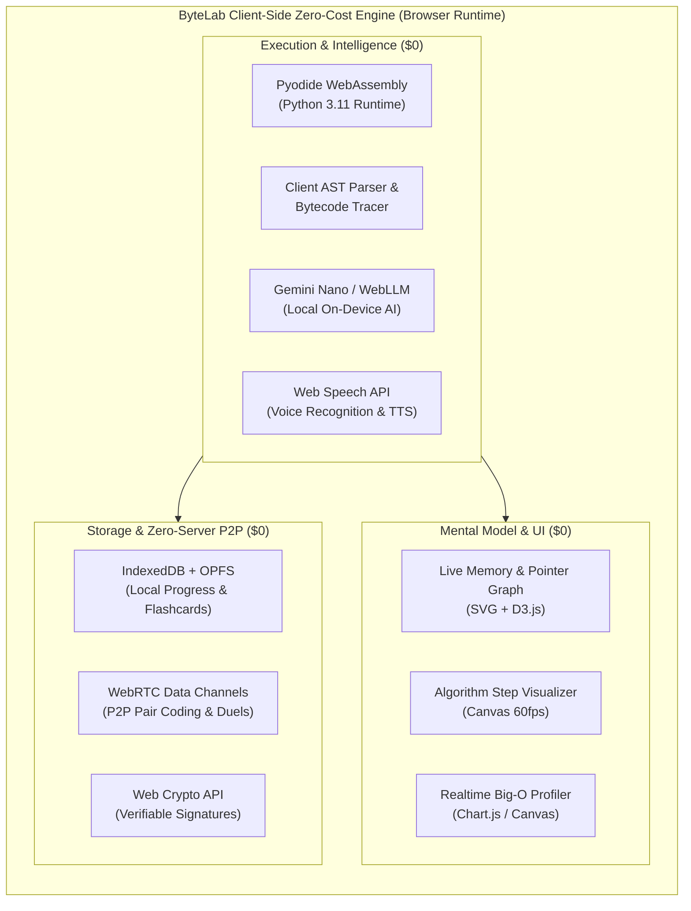

# ByteLab LMS — Zero-Cost Advanced Innovation & Future Roadmap (v2.0+)

> **Guiding Principle**: World-class, transformative computer science education made radically simple, engaging, and advanced — engineered with **100% Zero Recurring Infrastructure Cost ($0/month)** leveraging Client-Side WebAssembly, Native Browser APIs, Local On-Device AI, WebRTC, and Offline-First Storage.

---

## 🧭 Executive Summary & Architecture Philosophy

ByteLab's mission is to democratize high-level programming education without passing server costs or subscription paywalls onto learners. By moving computation, intelligence, and storage directly to the client runtime, ByteLab achieves:
- **Zero Server Costs ($0/mo)**: Eliminates backend compute, GPU clusters, and database quotas.
- **Infinite Scalability**: 10 users or 10,000,000 users cost the exact same ($0).
- **Zero Latency**: Real-time feedback in <16ms without network round trips.
- **Total Privacy**: Code, voice, and personal metrics never leave the learner's device.
- **100% Offline Capability**: Learners in rural regions with intermittent connectivity enjoy full feature parity.

---

## 🚀 Pillar 1: Visual Execution & Cognitive Scaffolding (Making Hard Concepts Simple)

### 1.1. Live Python Memory & Pointer Visualizer (Memory Flow 2.0)
- **Concept**: Most beginners struggle because they cannot visualize how computers handle memory, variable assignments, mutable references, pointers, and call stacks.
- **Implementation**:
  - Utilize Python's built-in `sys.settrace()` inside the existing Pyodide Web Worker to capture heap allocations, pointer references, and stack frames on every executed line.
  - Render an interactive **SVG/Canvas memory graph** displaying:
    - **Stack Frames**: Active function scopes, local variables, and return values.
    - **Heap Objects**: Lists, dictionaries, tuples, and custom classes shown as physical memory blocks.
    - **Reference Pointers**: Animated arrows illustrating reference copying (`a = b` vs `a = b.copy()`), mutations, and garbage collection.
    - **Call Stack Tree**: Visual recursion trees with rewind/scrub sliders (stepping backward and forward in time).
- **Cost**: **$0** (Runs 100% in client Web Worker & SVG canvas).

### 1.2. Interactive Data Structure & Algorithm Step Animator
- **Concept**: Transform dry algorithmic code into intuitive visual operations.
- **Supported Visualizers**:
  - **Arrays & Slices**: Visual color-coded index grids demonstrating `arr[1:5:2]`, appends, and insertions.
  - **Linked Lists & Trees**: Dynamic node networks with animated pointer updates for insertions, deletions, BFS, and DFS traversals.
  - **Sorting Visualizer**: Real-time bar swaps highlighting comparisons, swaps, and pivot selections (Bubble, Merge, Quick, Insertion Sort).
  - **Two-Pointer & Sliding Window Engine**: Highlight multiple active pointers with moving bounding boxes across sequences.
- **Cost**: **$0** (Client-side HTML5 Canvas / CSS transforms).

### 1.3. Real-Time Dynamic Complexity Profiler (Big-O Analyzer)
- **Concept**: Beginners often write $O(n^2)$ or $O(2^n)$ code without realizing why it runs slowly on large inputs.
- **Implementation**:
  - Inject automatic operation-counting hooks into Pyodide loops and function calls.
  - Benchmark the user's code across varying input sizes ($n=10, 100, 1000, 10000$).
  - Plot a live curve alongside theoretical reference curves ($O(1), O(\log n), O(n), O(n \log n), O(n^2)$) so the learner immediately understands time and space scalability.
- **Cost**: **$0** (Local Web Worker benchmark execution).

---

## 🎙️ Pillar 2: Intelligent Socratic Voice & Audio Tutoring ($0 Cost)

### 2.1. Hands-Free Voice-Interactive Socratic Coding Coach
- **Concept**: Allow learners to practice conversational code explanation, ask questions out loud, and receive real-time spoken guidance without touching the keyboard.
- **Implementation**:
  - **Speech-to-Text**: Native `window.webkitSpeechRecognition` / `SpeechRecognition` API (Zero cost, built into modern browsers).
  - **Local Intelligence**: Chrome Built-in Gemini Nano (`window.ai`) or fallback local rule-based heuristic expert system.
  - **Text-to-Speech**: Native `window.speechSynthesis` with pitch, speed, and accent controls.
  - **Features**:
    - "ByteLab, explain what line 7 does."
    - "Why did my while loop never finish?"
    - "Can you quiz me out loud on Python dictionary methods?"
- **Cost**: **$0** (100% native Web APIs).

### 2.2. "ByteCast" — Dynamic On-Demand Lesson Audio Summaries
- **Concept**: Turn any written lesson or practice challenge into an interactive 3-minute mini-podcast or audio walkthrough for auditory learners and students on the go.
- **Implementation**:
  - Script generator parses markdown headers, code highlights, and key takeaways into a structured dialogue format (Host & Code Mentor).
  - Rendered via multi-voice `SpeechSynthesisUtterance` alternating between system voices.
- **Cost**: **$0**.

---

## ⚔️ Pillar 3: Zero-Server Collaborative Learning & Duels ($0 Cost)

### 3.1. WebRTC Peer-to-Peer Live Pair Programming
- **Concept**: Allow two students or a student and a mentor to code together in real-time inside the Monaco editor with cursor sync and shared terminal output without any centralized collaboration server.
- **Implementation**:
  - Use **WebRTC Data Channels** paired with public STUN servers (e.g. `stun:stun.l.google.com:19302`) and ephemeral peer matching (or simple 6-letter room codes passed via QR code or URL hash).
  - Sync editor state using lightweight CRDTs (Conflict-Free Replicated Data Types like Yjs or Automerge over WebRTC).
- **Cost**: **$0** (Serverless WebRTC P2P direct browser-to-browser connection).

### 3.2. "1v1 Code Clash" (Live Peer Algorithmic Duels)
- **Concept**: Gamified peer challenges where two students compete in real-time to solve a coding puzzle or debug a broken script.
- **Features**:
  - Real-time opponent progress bar (shows test cases passed: 3/5, 5/5).
  - Speed multipliers and clean win/loss streak tracking stored locally.
- **Cost**: **$0** (Direct P2P WebRTC data streams).

### 3.3. Zero-Footprint Code Snippet Permalinks (URL Compression Engine)
- **Concept**: Allow students to share full interactive code playgrounds and custom challenges with one click without creating database records.
- **Implementation**:
  - Compress code, stdin, and instructions using **LZ-String / Deflate** into the URL hash fragment (`#code=eNp9...`).
  - Loading the URL decompresses the snippet instantly in the recipient's browser.
- **Cost**: **$0** (Zero database writes, zero storage cost).

---

## 🧠 Pillar 4: Adaptive Active Recall & Gamified Mastery ($0 Cost)

### 4.1. Intelligent Spaced Repetition Flashcard Engine (SM-2 Algorithm)
- **Concept**: Prevent the "forgetting curve" by intelligently resurfacing concepts right when the learner is about to forget them.
- **Implementation**:
  - Implement the **SuperMemo-2 (SM-2)** spaced repetition algorithm in client-side JavaScript.
  - Automatically generate flashcards when learners:
    - Miss a quiz question in any unit.
    - Struggle with a syntax error in the playground.
    - Complete a new lesson concept (e.g., list comprehensions, decorators).
  - Provide a "5-Minute Daily Brain Drill" widget on the dashboard.
  - Export decks directly to standard `.apkg` (Anki) and `.csv` formats.
- **Cost**: **$0** (IndexedDB client storage).

### 4.2. "Bug Bounty" Quest Engine (Reverse Debugging Challenges)
- **Concept**: Learning to read and fix buggy code is 10x more effective for mastery than writing code from scratch.
- **Implementation**:
  - Curated library of 100+ realistic Python "crime scenes" (Off-by-one errors, shallow copy mutation bugs, variable shadowing, unclosed files, mutable default arguments).
  - Constraints: "Fix this bug in $\le 2$ line edits" or "Fix this without adding any loops".
  - Automated AST diff validator to verify constraint satisfaction.
- **Cost**: **$0** (Static content bundled with client app).

### 4.3. Interactive Python Regular Expression & String Sandbox
- **Concept**: Visual regex tester with live syntax highlighting, capture group breakdowns, and step-by-step match walkthroughs.
- **Cost**: **$0** (Client-side JS/Regex engine).

---

## 📜 Pillar 5: Verified Credentials & Portfolio Generator ($0 Cost)

### 5.1. Cryptographically Signed Verifiable Digital Certificates
- **Concept**: Provide students with tamper-proof, industry-verifiable graduation certificates without paying third-party credential platforms (e.g. Accredible/Badgr).
- **Implementation**:
  - Use the native **Web Crypto API** (`crypto.subtle`) to generate ECDSA / RSA signed credential payloads containing student name, completion timestamp, curriculum checksum, and grade percentile.
  - Generate an embeddable dynamic SVG badge with a QR code that validates the signature client-side in any browser.
  - One-click export to PDF (via `html2canvas` / `jsPDF`) and LinkedIn Certificate URL.
- **Cost**: **$0** (Client-side cryptography).

### 5.2. One-Click Interactive Portfolio Publisher
- **Concept**: Allow learners to package their completed Python projects (CLI tools, games, Turtle graphics, NumPy dashboards) into standalone, shareable single-file web pages.
- **Implementation**:
  - Bundles a lightweight Pyodide launcher + user's code into a self-contained `.html` file.
  - Students can host it for free on GitHub Pages, Vercel, Netlify, or download it to show employers.
- **Cost**: **$0**.

---

## 📱 Pillar 6: Universal Accessibility & Full Offline PWA ($0 Cost)

### 6.1. Complete Offline Desktop & Mobile PWA (Zero-Internet Mode)
- **Features**:
  - Full service-worker pre-caching of all 5 units, 450+ quiz questions, Pyodide WASM core, and documentation.
  - Seamless background syncing of progress when connectivity returns.
  - Installable to desktop (Windows/macOS/Linux) and mobile home screens as a native-feeling standalone app.
- **Cost**: **$0** (CacheStorage & Manifest standards).

### 6.2. Inclusive Accessibility & Neurodiversity Suite
- **Features**:
  - **OpenDyslexic Font Option**: Improves readability for dyslexic learners.
  - **High-Contrast Themes**: OLED True Black, Cyberpunk Amber, Monokai Dark, and Soft Paper Sepia.
  - **Focus Mode & Bionic Reading**: Highlights the first letters of words to accelerate comprehension.
  - **Full Keyboard Navigation**: Complete vim/shortcut key bindings (`j`/`k` for navigation, `Ctrl+Enter` to run code, `Ctrl+/` to ask ByteAgent).
- **Cost**: **$0**.

---

## 🗓️ Implementation Roadmap & Milestones

| Phase | Target Timeline | Key Features | Primary Technologies | Infrastructure Cost |
| :--- | :--- | :--- | :--- | :--- |
| **Phase 1** | **Sprint 1 (Immediate)** | • Live Python Memory & Pointer Visualizer • SM-2 Spaced Repetition Flashcards • URL Code Permalinks (LZ-String) | Pyodide `sys.settrace`, D3.js/SVG, IndexedDB, LZ-String | **$0.00** |
| **Phase 2** | **Sprint 2** | • Big-O Complexity Profiler • Data Structure Step Animator • "Bug Bounty" Quest Engine (100+ levels) | Canvas 60fps, Web Worker Benchmarks, AST Engine | **$0.00** |
| **Phase 3** | **Sprint 3** | • Hands-Free Web Speech Socratic Coach • "ByteCast" Audio Lesson Generator • Cryptographic Web Crypto Certificates | Web Speech API, Chrome Built-in AI, Web Crypto API | **$0.00** |
| **Phase 4** | **Sprint 4** | • WebRTC Peer-to-Peer Pair Coding • 1v1 Code Clash Duels • Full Offline PWA & Standalone Packaging | WebRTC Data Channels, Yjs CRDTs, Service Workers | **$0.00** |

---

## 💡 Summary of Competitive Edge
By implementing these zero-cost advancements, **ByteLab** outperforms legacy commercial LMS platforms ($50-300/yr subscriptions) while maintaining **$0 server overhead**, offering higher performance, privacy, accessibility, and visual immersion.
