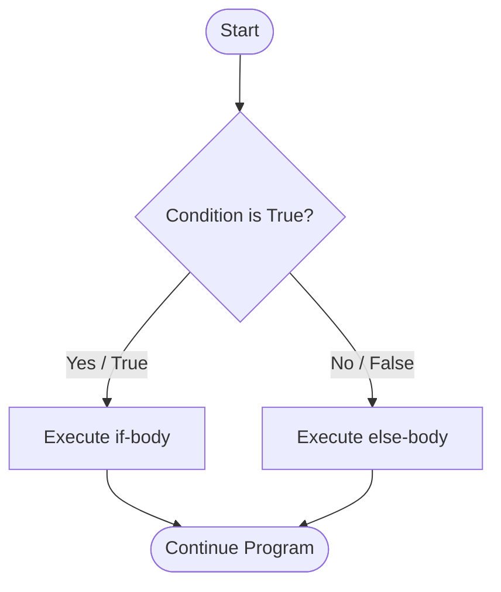
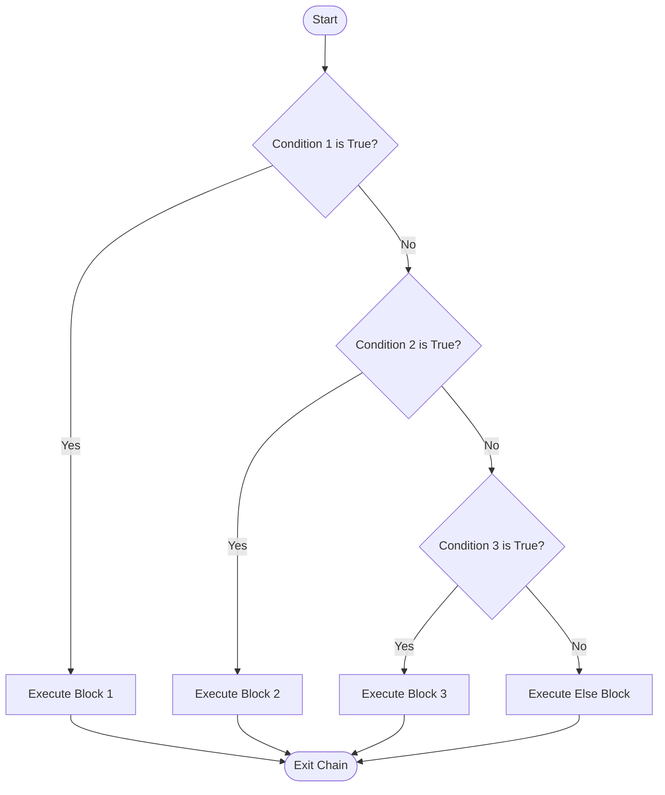
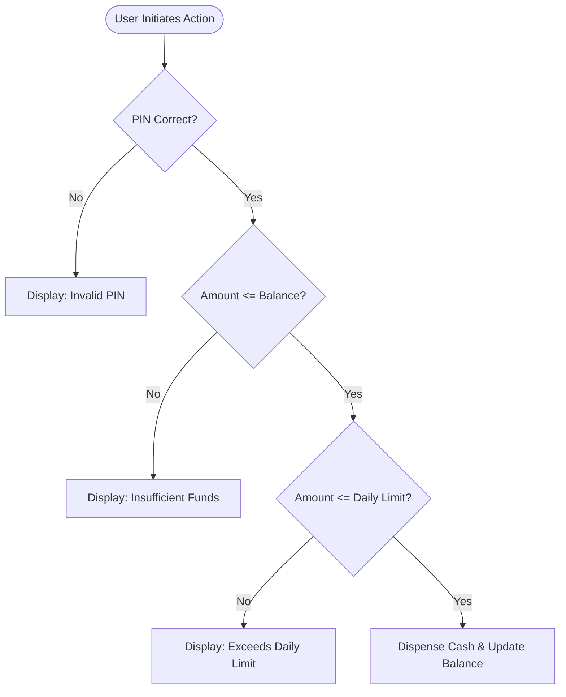

# Unit–II — Day 2: Alternative, Chained & Nested Conditional Statements

**Duration:** 90 Minutes  
**Level:** Beginner to Intermediate  
**Unit:** Unit–II — Control Flow & Functions  
**Day:** 2 (Course Day 14)  
**Curriculum Alignment:** 19AI301 / CS3301 — Outcome CO2  
**Topics:** Alternative Conditional (`if-else`), Pythonic Conditional Expressions (Ternary Operator), Chained Conditionals (`if-elif-else`), The First-True-Condition Principle, Nested Conditional Statements, Guard Clauses & Early Returns, Chained Comparison Operators, Progressive Slab Billing, Performance & Short-Circuit Optimization.

---

## 1. Day 2 Learning Objectives

By the end of this session, students will be able to:
- **Understand Binary Decision Branches:** Explain why standalone `if` statements fail to provide explicit alternative execution paths and utilize `if-else` for mutually exclusive logic.
- **Write Pythonic Ternary Expressions:** Leverage conditional expressions (`x if condition else y`) for clean, single-line variable assignments and return statements.
- **Master Multi-Way Decision Chains:** Construct robust `if-elif-else` pipelines for multi-category classification and range evaluation.
- **Enforce the First-True-Condition Rule:** Predict and trace how Python terminates chained condition evaluation immediately upon encountering the first `True` condition, preventing unreachable dead code.
- **Design Hierarchical Decision Trees:** Architect nested conditionals where secondary decisions depend strictly on primary prerequisites.
- **Evaluate Architectural Trade-offs:** Systematically decide when to use nested conditionals versus combining conditions with logical operators (`and`, `or`).
- **Refactor with Guard Clauses:** Eliminate deeply nested "Pyramids of Doom" using early returns to improve code readability and maintainability.
- **Optimize Condition Order:** Harness short-circuiting to evaluate cheap $O(1)$ conditions before computationally expensive checks.
- **Implement Real-World Algorithms:** Code resilient real-world systems including ATM transaction validators, student letter grading, and progressive tiered electricity tariff calculation.
- **Debug Common Traps:** Identify and resolve independent `if` fallthrough bugs, misplaced boundary order, floating-point equality traps, and indentation errors.

---

## 2. 90-Minute Structured Session Plan

| Time | Duration | Topic | Pedagogical Activity |
| :--- | :--- | :--- | :--- |
| **00–05 min** | 5 min | Day 1 Connection & Diagnostic Review | Quick recap of boolean expressions, comparisons, and simple `if` limitations |
| **05–20 min** | 15 min | The Alternative Conditional: `if-else` | Mechanics, syntax, flowchart, mutual exclusion, and ternary expressions |
| **20–40 min** | 20 min | Chained Conditionals: `if-elif-else` | Syntax, First-True-Condition principle, condition ordering, and dead code |
| **40–55 min** | 15 min | Nested Conditionals & Hierarchies | Multi-gate decisions, flowcharts, and nested `if` vs logical operators |
| **55–68 min** | 13 min | Clean Architecture: Guard Clauses | Refactoring the "Pyramid of Doom" and modern Python 3.10+ `match-case` |
| **68–78 min** | 10 min | Industrial Case Studies | Progressive utility slab billing & ATM transaction validation pipelines |
| **78–84 min** | 6 min | Common Traps & Debugging Lab | Float comparisons, independent `if` traps, and execution trace tables |
| **84–90 min** | 6 min | Hands-On Practice & Assessment | Solving Moodle lab challenges and taking the 10-question mastery quiz |

---

## 3. Quick Recap from Day 1: The Dilemma of Simple `if`

In Day 1, we introduced simple conditional execution using `if`:

```python
mark = 35
if mark >= 40:
    print("Pass")
```

### The Silent Failure Problem
When `mark = 35`, the condition `mark >= 40` evaluates to `False`. The Python interpreter skips the indented block and continues execution. To the end-user or student, the program produces **absolutely no output**.

In production software, systems must provide explicit feedback for both success and failure:
- A login screen must state *"Invalid password"*, not remain blank.
- An ATM must state *"Insufficient funds"*, not fail silently.
- An examination portal must display *"Fail"*, not nothing.

To provide an alternative path, we require **two-way branching**.

---

## 4. The Alternative Conditional: `if-else`

The `if-else` statement provides two distinct, mutually exclusive execution branches.

### Mental Model: The Railway Switch
Think of an `if-else` statement like a railway track switch:
- When the switch is set to **True**, the train is routed down **Track A**.
- When the switch is set to **False**, the train is routed down **Track B**.
- The train **cannot travel on both tracks simultaneously**, and it **cannot skip both tracks**. Exactly one route is chosen.



### Syntax & Grammar
```python
if condition:
    # Executes ONLY when condition evaluates to True (truthy)
    statement_1
    statement_2
else:
    # Executes ONLY when condition evaluates to False (falsy)
    statement_3
    statement_4
```

> [!IMPORTANT]
> The `else` keyword is a catch-all alternative. It **never takes a condition expression**. Writing `else x < 10:` is an immediate `SyntaxError`.

### Core Example: Pass / Fail
```python
mark = 55

if mark >= 40:
    print("Result: Pass")
else:
    print("Result: Fail")

print("Evaluation Complete.")
```

**Output:**
```text
Result: Pass
Evaluation Complete.
```

### Guaranteed Mutual Exclusion
In an `if-else` construct, exactly one branch executes per pass:
- If `condition` is `True` $\rightarrow$ `if` block executes, `else` block is **bypassed**.
- If `condition` is `False` $\rightarrow$ `if` block is **bypassed**, `else` block executes.

---

## 5. Real-World Case Studies of `if-else`

### Case Study 1: Even vs. Odd Number Detection
In mathematics and computer science, an integer is **even** if divisible by 2 with zero remainder, and **odd** otherwise. We use Python's modulus operator `%`:

```python
number = 17

if number % 2 == 0:
    print(f"{number} is Even")
else:
    print(f"{number} is Odd")
```
**Output:**
```text
17 is Odd
```

### Case Study 2: Authentication Credential Guard
```python
entered_password = "SecurePassword123"
stored_password = "SecurePassword123"

if entered_password == stored_password:
    print("Access Granted: Welcome to the Dashboard.")
else:
    print("Access Denied: Incorrect Password.")
```

### Case Study 3: E-Commerce Free Shipping Qualification
```python
cart_total = 749.00
free_shipping_threshold = 500.00

if cart_total >= free_shipping_threshold:
    shipping_cost = 0.00
    print(f"Eligible for Free Shipping! Delivery: ₹{shipping_cost:.2f}")
else:
    shipping_cost = 50.00
    print(f"Standard Delivery: ₹{shipping_cost:.2f}. Add ₹{free_shipping_threshold - cart_total:.2f} for free delivery.")
```
**Output:**
```text
Eligible for Free Shipping! Delivery: ₹0.00
```

---

## 6. Pythonic Conditional Expressions (The Ternary Operator)

In many scenarios, an `if-else` block is used solely to assign a value to a variable based on a single condition:

```python
# Traditional multi-line if-else:
age = 20
if age >= 18:
    status = "Adult"
else:
    status = "Minor"
```

Python provides a concise, single-line expression known as the **ternary operator** or **conditional expression**:

### Syntax
```python
variable = value_if_true if condition else value_if_false
```

### Example
```python
age = 20
status = "Adult" if age >= 18 else "Minor"
print("Status:", status) # Output: Status: Adult

# Inline within print statements:
score = 42
print("Result:", "Passed" if score >= 40 else "Failed") # Output: Result: Passed
```

> [!TIP]
> **When to use ternary expressions:** Use conditional expressions for simple value assignments or returns. If the logic involves multiple statements, side effects, or complex expressions, use the standard multi-line `if-else` for better readability. Avoid nesting ternary expressions (`a if c1 else b if c2 else d`), as they quickly degrade code clarity.

---

## 7. Multi-Way Decisions: Chained Conditionals (`if-elif-else`)

What happens when a problem has **more than two** possible outcomes?

Consider grading a student:
- Score $\ge 90$: Grade `A`
- Score $75 - 89$: Grade `B`
- Score $60 - 74$: Grade `C`
- Score $40 - 59$: Grade `D`
- Score $< 40$: Grade `F`

Attempting to solve this with only `if` and `else` creates deeply indented, unreadable code:

```python
# Clunky nested if-else (Avoid this pattern):
if mark >= 90:
    grade = "A"
else:
    if mark >= 75:
        grade = "B"
    else:
        if mark >= 60:
            grade = "C"
        else:
            if mark >= 40:
                grade = "D"
            else:
                grade = "F"
```

To solve this cleanly at a single indentation level, Python provides the **`elif`** keyword (a contraction of **else if**).

### Syntax of `if-elif-else`
```python
if condition_1:
    # Executes if condition_1 is True
    block_1
elif condition_2:
    # Executes if condition_1 was False AND condition_2 is True
    block_2
elif condition_3:
    # Executes if all previous conditions were False AND condition_3 is True
    block_3
else:
    # Fallback: Executes if ALL previous conditions were False
    fallback_block
```



---

## 8. The First-True-Condition Principle

Understanding the exact evaluation mechanism of an `if-elif-else` chain is critical for writing correct programs.

> [!IMPORTANT]
> **The Golden Rule:** In an `if-elif-else` chain, Python evaluates conditions **strictly from top to bottom** and **terminates evaluation immediately upon encountering the first `True` condition**. All remaining `elif` branches and the `else` branch are completely skipped.

### Code Demonstration
```python
mark = 82

if mark >= 90:
    print("Grade A")
elif mark >= 75:
    print("Grade B")
elif mark >= 60:
    print("Grade C")
else:
    print("Grade F")
```

**Step-by-Step Execution Trace:**
1. Evaluates `mark >= 90` $\rightarrow$ `82 >= 90` is `False`.
2. Moves to next branch: `mark >= 75` $\rightarrow$ `82 >= 75` is `True`.
3. Executes `print("Grade B")`.
4. **Immediately jumps out of the entire construct!** Python does *not* evaluate `mark >= 60`, even though $82 \ge 60$ is mathematically true.

### The Inverted Ordering Bug (Dead Code)
Because the first `True` condition wins, **condition order matters immensely**.

```python
# DANGEROUS / BUGGY CODE:
mark = 95

if mark >= 40:
    print("Pass")
elif mark >= 90:
    print("Distinction")
```
**Output:**
```text
Pass
```
Because `95 >= 40` evaluates to `True`, the program executes `"Pass"` and exits! The `"Distinction"` branch can **never** execute for any mark $\ge 90$ because any number $\ge 90$ is already $\ge 40$. The `"Distinction"` block is effectively **dead code**.

> [!WARNING]
> Always arrange your thresholds from the **most restrictive (highest/most specific)** to the **least restrictive (lowest/most general)**.

---

## 9. Real-World Applications of Chained Conditionals

### Application 1: Academic Letter Grading with Honors
```python
def determine_academic_standing(score):
    if score < 0 or score > 100:
        return "Invalid Score (Must be 0-100)"
    elif score >= 90:
        return "Grade A+ (First Class with Distinction)"
    elif score >= 80:
        return "Grade A (First Class)"
    elif score >= 70:
        return "Grade B (Second Class Upper)"
    elif score >= 60:
        return "Grade C (Second Class Lower)"
    elif score >= 50:
        return "Grade D (Third Class)"
    elif score >= 40:
        return "Grade E (Pass)"
    else:
        return "Grade F (Reappear)"

print(determine_academic_standing(92)) # Output: Grade A+ (First Class with Distinction)
print(determine_academic_standing(45)) # Output: Grade E (Pass)
print(determine_academic_standing(105)) # Output: Invalid Score (Must be 0-100)
```

### Application 2: Dynamic Transit Fare Engine
```python
passenger_age = 65

if passenger_age < 5:
    fare = 0.00
    category = "Infant (Complimentary)"
elif passenger_age <= 12:
    fare = 15.00
    category = "Child Discount"
elif passenger_age <= 59:
    fare = 30.00
    category = "Standard Adult"
else:
    fare = 18.00
    category = "Senior Citizen Concession"

print(f"Category: {category} | Fare: ₹{fare:.2f}")
```
**Output:**
```text
Category: Senior Citizen Concession | Fare: ₹18.00
```

### Application 3: Interactive Command Menu Dispatcher
```python
menu_option = 2

if menu_option == 1:
    print("Executing: Create New Student Record")
elif menu_option == 2:
    print("Executing: Search Student by Roll Number")
elif menu_option == 3:
    print("Executing: Generate Semester Grade Sheet")
elif menu_option == 4:
    print("Executing: Export Database Backup")
elif menu_option == 0:
    print("Executing: Exit Application")
else:
    print(f"Error: Option '{menu_option}' is not a recognized command.")
```
**Output:**
```text
Executing: Search Student by Roll Number
```

---

## 10. Chained Comparison Operators in Python

In mathematics, we routinely write:
$$18 \le \text{age} < 65$$

In many languages (like C, C++, Java), you cannot write this directly; you must combine two relational operations:
`age >= 18 && age < 65`

**Python natively supports mathematical chained comparisons!**

```python
age = 25

# Pythonic chained comparison:
if 18 <= age < 65:
    print("Working age adult")

# Exactly equivalent to:
if age >= 18 and age < 65:
    print("Working age adult")
```

### Multi-Operator Chaining
Python evaluates `a < b <= c` as `(a < b) and (b <= c)`, with the optimization that `b` is evaluated **only once**.

```python
score = 85
if 80 <= score <= 90:
    print("Score is solidly in the B+ bracket")
```

---

## 11. Nested Conditionals: Hierarchical Decisions

A **nested conditional** occurs when an `if`, `elif`, or `else` statement is placed inside the body of another conditional statement.

### Why Do We Need Nested `if`?
Real-world decisions are often **hierarchical** rather than flat:
- You only check whether an account has sufficient balance **if** the user's PIN is verified.
- You only check whether a file has write permissions **if** the file actually exists on disk.
- You only check advanced subject criteria **if** the candidate passes basic age and entrance prerequisites.



### Syntax and Indentation Rules
```python
if outer_condition:
    # Outer block (indented 4 spaces)
    if inner_condition_1:
        # Inner block 1 (indented 8 spaces)
        statement_A
    else:
        # Inner block 2 (indented 8 spaces)
        statement_B
else:
    # Outer fallback (indented 4 spaces)
    statement_C
```

> [!CAUTION]
> In Python, block structure is governed strictly by indentation. A misaligned `else` can attach to the wrong `if`, causing subtle logic bugs (the classic "floating else" problem). Always use 4 spaces per indentation level.

---

## 12. Real-World Nested Decision Systems

### System 1: Automated Teller Machine (ATM) Transaction Pipeline
```python
pin_verified = True
account_balance = 15000.00
daily_withdrawal_limit = 10000.00
withdrawal_amount = 6000.00

if pin_verified:
    if withdrawal_amount > account_balance:
        print("Transaction Declined: Insufficient Account Balance.")
    else:
        if withdrawal_amount > daily_withdrawal_limit:
            print("Transaction Declined: Amount exceeds daily ATM limit of ₹10,000.")
        else:
            account_balance -= withdrawal_amount
            print(f"Transaction Successful! Dispensed: ₹{withdrawal_amount:.2f}")
            print(f"Remaining Account Balance: ₹{account_balance:.2f}")
else:
    print("Transaction Blocked: Incorrect PIN entered.")
```

**Output:**
```text
Transaction Successful! Dispensed: ₹6000.00
Remaining Account Balance: ₹9000.00
```

### System 2: University Honors Admission Pipeline
```python
entrance_cutoff_cleared = True
maths_score = 92
has_disciplinary_record = False

if entrance_cutoff_cleared:
    if not has_disciplinary_record:
        if maths_score >= 90:
            print("Status: Admitted with Honors Fellowship")
        elif maths_score >= 75:
            print("Status: Admitted to Regular Engineering Program")
        else:
            print("Status: Admitted on Remedial Mathematics Track")
    else:
        print("Status: Disqualified due to Disciplinary Infraction")
else:
    print("Status: Not Admitted (Entrance Cutoff Not Met)")
```
**Output:**
```text
Status: Admitted with Honors Fellowship
```

---

## 13. Nested Conditionals vs. Logical Operators (`and` / `or`)

Students often wonder: *“Why write nested `if` statements when we can combine everything with `and`?”*

Consider checking college eligibility:

```python
# Approach A: Combined using logical 'and'
if age >= 18 and entrance_score >= 50:
    print("Eligible for Admission")
else:
    print("Not Eligible")
```

```python
# Approach B: Hierarchical Nested 'if'
if age >= 18:
    if entrance_score >= 50:
        print("Eligible for Admission")
    else:
        print("Ineligible: Entrance score below 50")
else:
    print("Ineligible: Minimum age requirement (18) not satisfied")
```

### Detailed Decision Matrix

| Dimension | Logical Operators (`and` / `or`) | Nested Conditionals |
| :--- | :--- | :--- |
| **Feedback Granularity** | Generic (Cannot easily tell user *which* clause failed) | Precise (Provides distinct error message for each specific failure) |
| **Code Verbosity** | Compact, fewer lines of code | More lines, requires additional indentation |
| **Crash Prevention (Guarded Execution)** | Dependent on short-circuit evaluation | Guarantees inner code only runs if outer guard condition passes |
| **Best Used When** | Both checks are simple and failure handling is identical | Prerequisite checks must pass first, or detailed failure reasons are required |

---

## 14. Clean Architecture: Guard Clauses (The Early Return Pattern)

When nesting becomes 3, 4, or 5 levels deep, code starts slanting to the right. In software engineering, this is known as the **"Pyramid of Doom"** or the **"Arrow Anti-Pattern"**:

```python
# ANTI-PATTERN: The Deeply Nested Arrow
def process_withdrawal(user, pin, amount):
    if user is not None:
        if user.is_active:
            if user.verify_pin(pin):
                if amount <= user.balance:
                    if amount <= 10000:
                        user.balance -= amount
                        return f"Success! Dispensed ₹{amount}"
                    else:
                        return "Error: Exceeds daily limit"
                else:
                    return "Error: Insufficient balance"
            else:
                return "Error: Invalid PIN"
        else:
            return "Error: Account deactivated"
    else:
        return "Error: User not found"
```

### The Clean Solution: Guard Clauses
A **guard clause** checks for failure or invalid conditions **at the top** of the function and returns immediately:

```python
# CLEAN PATTERN: Flat Guard Clauses (Early Return)
def process_withdrawal_clean(user, pin, amount):
    if user is None:
        return "Error: User not found"
    if not user.is_active:
        return "Error: Account deactivated"
    if not user.verify_pin(pin):
        return "Error: Invalid PIN"
    if amount > user.balance:
        return "Error: Insufficient balance"
    if amount > 10000:
        return "Error: Exceeds daily limit"

    # Happy Path (Indented only once!):
    user.balance -= amount
    return f"Success! Dispensed ₹{amount}"
```

> [!TIP]
> **Production Standard:** Prefer guard clauses with early returns in functions. They keep the "happy path" cleanly aligned on the left margin and handle error conditions upfront.

---

## 15. Modern Perspective: Python 3.10+ `match-case` vs `if-elif-else`

Python 3.10 introduced **Structural Pattern Matching** (`match-case`), providing a modern alternative to long `if-elif-else` chains for matching literal values or data structures.

### Comparing `if-elif-else` with `match-case`

```python
status_code = 404

# Traditional if-elif-else:
if status_code == 200:
    message = "OK: Request Succeeded"
elif status_code == 301:
    message = "Moved Permanently: Redirection"
elif status_code == 400:
    message = "Bad Request: Client Error"
elif status_code == 404:
    message = "Not Found: Resource does not exist"
elif status_code == 500:
    message = "Internal Server Error"
else:
    message = "Unknown Status Code"
```

```python
# Modern Python 3.10+ Structural Pattern Matching:
match status_code:
    case 200:
        message = "OK: Request Succeeded"
    case 301:
        message = "Moved Permanently: Redirection"
    case 400:
        message = "Bad Request: Client Error"
    case 404:
        message = "Not Found: Resource does not exist"
    case 500:
        message = "Internal Server Error"
    case _:
        message = "Unknown Status Code"
```

### When to Use Which?
- **Use `match-case`** when matching exact constants, HTTP status codes, command strings, or unpacking tuple/dictionary data structures.
- **Use `if-elif-else`** when evaluating **ranges** (e.g., `score >= 90`), floating-point values, or arbitrary boolean predicates (`x > y and is_valid`).

---

## 16. Performance & Short-Circuit Optimization

Python uses **short-circuit evaluation** for logical operators `and` and `or`:
- In `A and B`: If `A` is `False`, Python **never evaluates `B`** (because the whole expression is already guaranteed to be `False`).
- In `A or B`: If `A` is `True`, Python **never evaluates `B`** (because the whole expression is already guaranteed to be `True`).

### Practical Optimization Rule: Cheap Check First
Suppose you have a fast in-memory boolean check ($O(1)$) and a slow database lookup ($O(N)$ or 200ms network delay):

```python
# SLOW / UNOPTIMIZED:
# Python might execute the slow query first!
if query_database_for_user(user_id) and is_cache_valid:
    display_profile()

# FAST / OPTIMIZED:
# If is_cache_valid is False, the slow DB query is completely skipped!
if is_cache_valid and query_database_for_user(user_id):
    display_profile()
```

### High-Probability Branches First
In an `if-elif-else` chain that executes millions of times (e.g., in data processing or web servers):
- Place the **most frequently occurring branch** at the top of the chain so the interpreter finds a match on the very first check.

---

## 17. Industrial Case Study: Progressive Utility Slab Billing

A common real-world algorithmic challenge in utilities, telecommunications, and taxation is **cumulative progressive slab computation**.

### The Problem
An electricity board charges domestic consumers based on progressive tiers:
- **First 100 units (0 – 100):** Free (₹0.00 / unit)
- **Next 100 units (101 – 200):** ₹2.50 per unit
- **Next 200 units (201 – 400):** ₹4.50 per unit
- **Above 400 units (> 400):** ₹6.50 per unit

> [!NOTE]
> **Critical Concept:** If a household consumes 250 units, they do **not** pay ₹4.50 for all 250 units!
> - The first 100 units cost: $100 \times 0 = ₹0$
> - The next 100 units (101 to 200) cost: $100 \times 2.50 = ₹250$
> - The remaining 50 units (201 to 250) cost: $50 \times 4.50 = ₹225$
> - **Total Bill:** $0 + 250 + 225 = ₹475.00$

### Implementation with `if-elif-else`
```python
def calculate_electricity_bill(units):
    if units <= 0:
        return 0.00
    elif units <= 100:
        bill = 0.00
    elif units <= 200:
        # Units between 101 and 200 billed at ₹2.50
        bill = (units - 100) * 2.50
    elif units <= 400:
        # 100 units @ ₹2.50 + remaining units @ ₹4.50
        bill = (100 * 2.50) + (units - 200) * 4.50
    else:
        # 100 units @ ₹2.50 + 200 units @ ₹4.50 + remaining @ ₹6.50
        bill = (100 * 2.50) + (200 * 4.50) + (units - 400) * 6.50

    return bill

print(f"50 units  -> ₹{calculate_electricity_bill(50):.2f}")   # ₹0.00
print(f"150 units -> ₹{calculate_electricity_bill(150):.2f}")  # ₹125.00
print(f"250 units -> ₹{calculate_electricity_bill(250):.2f}")  # ₹475.00
print(f"500 units -> ₹{calculate_electricity_bill(500):.2f}")  # ₹1800.00
```

---

## 18. Step-by-Step Program Tracing Lab

Let us trace the execution of this nested conditional program:

```python
1:  customer_type = "Gold"
2:  cart_amount = 4500
3:  coupon_code = "SAVE10"
4:  discount = 0
5:  
6:  if cart_amount >= 3000:
7:      if customer_type == "Platinum":
8:          discount = 0.20
9:      elif customer_type == "Gold":
10:         discount = 0.15
11:     else:
12:         discount = 0.05
13:     if coupon_code == "SAVE10":
14:         discount += 0.10
15: else:
16:     discount = 0.00
17: 
18: final_price = cart_amount * (1 - discount)
19: print(f"Final: ₹{final_price:.2f}")
```

### Trace Table

| Step | Line | Variable State | Condition Checked | Result | Action Taken |
| :---: | :---: | :--- | :--- | :---: | :--- |
| **1** | 1–4 | `customer_type="Gold", cart_amount=4500, coupon="SAVE10", discount=0` | — | — | Variables initialized in local memory |
| **2** | 6 | Same | `cart_amount >= 3000` ($4500 \ge 3000$) | **`True`** | Enters outer `if` block at Line 7 |
| **3** | 7 | Same | `customer_type == "Platinum"` | **`False`** | Skips Line 8, tests next `elif` at Line 9 |
| **4** | 9 | Same | `customer_type == "Gold"` | **`True`** | Matches! Executes Line 10 |
| **5** | 10 | `discount = 0.15` | — | — | `discount` updated to `0.15` |
| **6** | 11–12 | Same | — | — | `else` branch skipped (first true condition won) |
| **7** | 13 | Same | `coupon_code == "SAVE10"` | **`True`** | Executes Line 14 |
| **8** | 14 | `discount = 0.25` | — | — | `discount` becomes $0.15 + 0.10 = 0.25$ (25%) |
| **9** | 15–16 | Same | — | — | Outer `else` skipped entirely |
| **10** | 18 | `final_price = 3375.00` | — | — | $4500 \times (1 - 0.25) = 3375.00$ |
| **11** | 19 | Same | — | — | Outputs: `Final: ₹3375.00` |

---

## 19. Common Traps, Pitfalls & Anti-Patterns (with Diagnostic Fixes)

### Trap 1: Independent `if` statements instead of `elif`
```python
# BUGGY CODE:
mark = 95
if mark >= 40:
    print("Pass")
if mark >= 75:
    print("Good")
if mark >= 90:
    print("Excellent")
```
**Output:**
```text
Pass
Good
Excellent
```
> **Root Cause:** Each `if` is treated as a completely separate, independent test. Because 95 is $\ge 40$, $\ge 75$, and $\ge 90$, **all three blocks execute**.  
> **Fix:** Use `if-elif-else` when categories are mutually exclusive.

### Trap 2: The Floating `else` (Indentation Mismatch)
```python
# MISLEADING INDENTATION:
x = 10
y = 5

if x > 20:
    if y > 2:
        print("Both high")
else:
    print("X is low")
```
> **Root Cause:** In languages with curly braces (`{}`), programmers often get confused about which `if` the `else` belongs to. In Python, the `else` strictly aligns with `if x > 20`. Because $10 > 20$ is `False`, Python outputs `"X is low"`. If the `else` were intended for `y > 2`, it must be indented under the inner `if`.

### Trap 3: Putting a Condition on `else`
```python
# SYNTAX ERROR:
score = 45
if score >= 50:
    print("Passed")
else score < 50:  # SyntaxError: invalid syntax
    print("Failed")
```
> **Root Cause:** `else` is an unconditional fallback.  
> **Fix:** Either remove the condition (`else:`) or convert it to `elif score < 50:`.

### Trap 4: Floating-Point Equality Trap
```python
# SUBTLE LOGICAL BUG:
a = 0.1 + 0.2
if a == 0.3:
    print("Equal")
else:
    print("Not Equal") # Prints: Not Equal!
```
> **Root Cause:** Binary floating-point representation causes rounding inaccuracies: `0.1 + 0.2` in Python is `0.30000000000000004`.  
> **Fix:** Use `math.isclose()` for floating point comparisons:
```python
import math
if math.isclose(a, 0.3):
    print("Equal")
```

### Trap 5: Redundant Boolean Equality Checks
```python
# UNPYTHONIC:
if is_logged_in == True:
    pass

# CLEAN & PYTHONIC:
if is_logged_in:
    pass
```

---

## 20. Quick Student Workouts

### Workout 1: Parity & Sign Checker
Predict the output:
```python
val = -4
if val > 0:
    print("Positive", "Even" if val % 2 == 0 else "Odd")
elif val < 0:
    print("Negative", "Even" if val % 2 == 0 else "Odd")
else:
    print("Zero")
```
<details>
<summary>View Answer & Explanation</summary>

**Output:** `Negative Even`  
**Explanation:** `val < 0` is `True` (Negative). The ternary expression checks `-4 % 2 == 0` (True), producing `Even`.
</details>

---

### Workout 2: Condition Ordering Diagnostic
What is printed when `score = 88`?
```python
score = 88
if score >= 60:
    grade = "C"
elif score >= 80:
    grade = "B"
elif score >= 90:
    grade = "A"
else:
    grade = "F"
print("Grade:", grade)
```
<details>
<summary>View Answer & Explanation</summary>

**Output:** `Grade: C`  
**Explanation:** Because `88 >= 60` is evaluated first and holds `True`, Python assigns `"C"` and skips the rest of the chain! This demonstrates why conditions must be ordered from highest threshold to lowest.
</details>

---

### Workout 3: Nested Scope & Variable Mutation
Predict the final value of `counter`:
```python
counter = 10
flag = True
tier = 2

if flag:
    counter += 5
    if tier == 1:
        counter *= 2
    elif tier == 2:
        counter += 10
    else:
        counter -= 5
else:
    counter = 0

print("Counter:", counter)
```
<details>
<summary>View Answer & Explanation</summary>

**Output:** `Counter: 25`  
**Explanation:** `flag` is `True` $\rightarrow$ `counter` becomes $10 + 5 = 15$. Then `tier == 2` matches $\rightarrow$ `counter` becomes $15 + 10 = 25$.
</details>

---

## 21. Unit–II Day 2 Comprehensive Cheat Sheet

| Construct | Syntax Pattern | Key Behavior | Primary Use Case |
| :--- | :--- | :--- | :--- |
| **`if-else`** | `if C: ... else: ...` | Guarantees exactly 1 of 2 mutually exclusive paths executes | Binary decisions (Pass/Fail, Valid/Invalid) |
| **Ternary Expression** | `val = A if C else B` | Evaluates inline as an expression, returning $A$ if $C$ else $B$ | Concise variable initialization / return statements |
| **`if-elif-else`** | `if C1: ... elif C2: ... else: ...` | Evaluates top-to-bottom; halts at **first `True` condition** | Multi-category classification, grading, menus |
| **Chained Comparisons** | `low <= x <= high` | Pythonic mathematical inequality chaining; single evaluation | Range validation ($0 \le \text{mark} \le 100$) |
| **Nested `if`** | `if C1: if C2: ...` | Hierarchical evaluation: inner check depends on outer truth | Multi-stage authentication, dependent permissions |
| **Guard Clauses** | `if not C: return ...` | Flattens nested code by exiting early on error conditions | Production function design, avoiding deep indentation |
| **`match-case`** | `match x: case 1: ...` | Structural pattern and literal value matching (Python 3.10+) | Menu codes, command routing, protocol status |

---

## 22. Day 2 Capstone Challenge: Comprehensive Loan Risk Assessor

A bank evaluates a personal loan application using this multi-factor decision policy:
1. **Age Requirement:** Applicant must be between 21 and 60 years old (inclusive). If not, reject with `"Ineligible: Age must be between 21 and 60"`.
2. **Monthly Income Check:**
   - Income $\ge ₹50,000$: Maximum eligible loan is ₹15,00,000.
   - Income $₹30,000$ to $₹49,999$: Maximum eligible loan is ₹8,00,000.
   - Income $< ₹30,000$: Reject with `"Ineligible: Minimum monthly income of ₹30,000 required"`.
3. **Credit Score Adjustment:**
   - Score $\ge 750$: Approved at standard rate with ₹0 processing fee.
   - Score $650 - 749$: Approved with standard processing fee of ₹2,500.
   - Score $< 650$: Reject with `"Ineligible: Credit score below 650"`.

### Python Solution Implementation
```python
def assess_loan_application(age, monthly_income, credit_score, requested_amount):
    # Guard 1: Age Constraint
    if not (21 <= age <= 60):
        return "Rejected: Age must be between 21 and 60."

    # Guard 2: Minimum Income Constraint
    if monthly_income < 30000:
        return "Rejected: Minimum monthly income of ₹30,000 required."

    # Guard 3: Credit Score Constraint
    if credit_score < 650:
        return "Rejected: Credit score below 650."

    # Calculate Maximum Cap based on Income Slabs
    if monthly_income >= 50000:
        max_loan_cap = 1500000
    else:
        max_loan_cap = 800000

    # Validate Requested Amount against Cap
    if requested_amount > max_loan_cap:
        return f"Rejected: Requested amount exceeds maximum cap of ₹{max_loan_cap:,}."

    # Processing Fee Assessment
    processing_fee = 0 if credit_score >= 750 else 2500

    return (
        f"Approved! Loan Amount: ₹{requested_amount:,} | "
        f"Processing Fee: ₹{processing_fee:,} | "
        f"Credit Tier: {'Prime' if credit_score >= 750 else 'Standard'}"
    )

# Test Runs:
print(assess_loan_application(age=28, monthly_income=65000, credit_score=780, requested_amount=1000000))
print(assess_loan_application(age=19, monthly_income=40000, credit_score=700, requested_amount=500000))
print(assess_loan_application(age=35, monthly_income=35000, credit_score=710, requested_amount=900000))
```

**Outputs:**
```text
Approved! Loan Amount: ₹1,000,000 | Processing Fee: ₹0 | Credit Tier: Prime
Rejected: Age must be between 21 and 60.
Rejected: Requested amount exceeds maximum cap of ₹800,000.
```

> [!TIP]
> Notice how using **guard clauses** at the top of the function prevents deeply nested `if-else` blocks and makes each business rule crystal clear!
