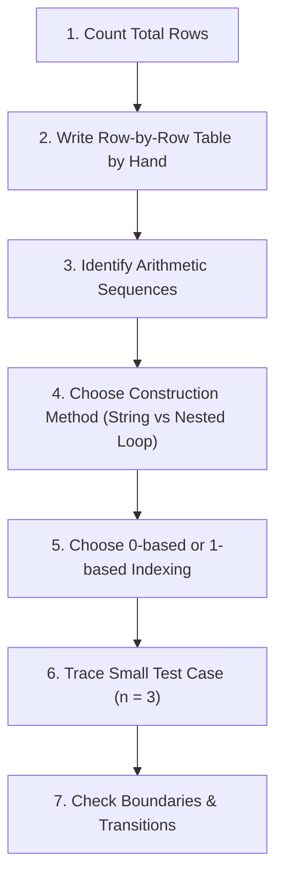

# Python Pattern Printing: Masterclass Notes

A practical, exhaustive reference for building 2D text patterns with Python loops, string operations, coordinate grids, and boundary logic.

> [!NOTE]
> **Core Idea:** Treat console output as a **2D Cartesian Grid** of $(row, column)$ coordinates. Decide what character or value belongs in each cell, then translate that rule into nested loops or concise Python string expressions.

---

## Lesson Navigation & Table of Contents

- [1. The Mental Model: 2D Grid Architecture](#1-the-mental-model-2d-grid-architecture)
- [2. Core Mechanics & Python Primitives](#2-core-mechanics--python-primitives)
  - [`print()` and Line Endings (`end=""`)](#print-and-line-endings-end)
  - [Repeating Strings with `*`](#repeating-strings-with-)
  - [`range()` Boundaries & Stepping](#range-boundaries--stepping)
  - [Row & Column Boundary Conditions](#row--column-boundary-conditions)
- [3. Pattern Library: Deep Dive & Code Implementations](#3-pattern-library-deep-dive--code-implementations)
  - [Pattern 1: Right-Angled Triangle](#pattern-1-right-angled-triangle)
  - [Pattern 2: Centered Pyramid](#pattern-2-centered-pyramid)
  - [Pattern 3: Symmetrical Diamond](#pattern-3-symmetrical-diamond)
  - [Pattern 4: Hollow Square & Hollow Border Grid](#pattern-4-hollow-square--hollow-border-grid)
  - [Pattern 5: Floyd's Triangle](#pattern-5-floyds-triangle)
  - [Pattern 6: Alphabet Triangle](#pattern-6-alphabet-triangle)
- [4. The 7-Step Method for Solving Novel Patterns](#4-the-7-step-method-for-solving-novel-patterns)
- [5. Common Traps, Formatting Bugs & Debugging](#5-common-traps-formatting-bugs--debugging)
- [6. Quick Syntax & Formula Reference](#6-quick-syntax--formula-reference)
- [7. Viva & Interview Questions](#7-viva--interview-questions)

---

# 1. The Mental Model: 2D Grid Architecture

Most console patterns can be visualized as a matrix of rows (vertical axis) and columns (horizontal axis):

```text
       Column 0   Column 1   Column 2   Column 3   Column 4
Row 0:    *          *          *          *          *
Row 1:    *          *          *          *          *
Row 2:    *          *          *          *          *
Row 3:    *          *          *          *          *
```

### Loop Roles

- **The Outer Loop:** Controls the current vertical **row**. It runs once for every row to be printed.
- **The Inner Loop:** Visits each horizontal **column** within that specific row.
- **The Cell Rule:** Evaluates whether a cell at `(row, col)` should display a star (`*`), a space (` `), a number, or a character.
- **The Row Terminator:** After the inner loop completes all columns for the current row, a newline `print()` moves the cursor down to the next row.

```python
for row in range(number_of_rows):
    for column in range(number_of_columns):
        # Decide what belongs at (row, column)
        ...
    print()  # Move to the next output line
```

> [!TIP]
> **When to use nested loops vs string multiplication:**
> - Use **nested loops** when individual cells require conditional logic (such as hollow borders, diagonal lines, alternating checkers, or incrementing counters).
> - Use **Python string multiplication (`"*" * count`)** when a row consists of uniform contiguous blocks of spaces or symbols. It is faster, shorter, and less prone to off-by-one index errors.

---

# 2. Core Mechanics & Python Primitives

## `print()` and Line Endings (`end=""`)

By default, Python's `print()` appends an invisible newline character (`\n`) to its output. To print multiple items horizontally on the same line, override the `end` keyword argument:

```python
print("*", end="")  # Stay on the current line
print("*")          # Print another star, then emit a newline
```

### Standard Nested Loop Grid Pattern:

```python
for row in range(3):
    for column in range(4):
        print("*", end=" ")
    print()  # Newline after each row
```

**Output:**

```text
* * * * 
* * * * 
* * * * 
```

---

## Repeating Strings with `*`

Python allows string repetition via the `*` operator. Multiplying a string by `0` or a negative integer yields an empty string `""`, which simplifies boundary handling without requiring extra `if` branches:

```python
print("* " * 5)
print("  " * 3 + "*" * 1)
```

---

## `range()` Boundaries & Stepping

The stop parameter in `range(start, stop[, step])` is **strictly exclusive**:

- `range(1, n + 1)` iterates through $1, 2, 3, \dots, n$ ($n$ iterations).
- `range(n - 1, 0, -1)` counts down backwards from $n - 1$ down to $1$ ($n - 1$ iterations).
- `range(0, n)` iterates through $0, 1, 2, \dots, n - 1$.

```python
# Counting up (1 to 5)
print(list(range(1, 6)))     # [1, 2, 3, 4, 5]

# Counting down (4 to 1)
print(list(range(4, 0, -1))) # [4, 3, 2, 1]
```

---

## Row & Column Boundary Conditions

For a square grid of size $N$, zero-based indices run from $0$ to $N - 1$. A cell lies on the perimeter if and only if:

$$\text{is\_border} \iff (\text{row} = 0) \lor (\text{row} = N - 1) \lor (\text{col} = 0) \lor (\text{col} = N - 1)$$

```python
is_border = (row == 0 or row == size - 1 or column == 0 or column == size - 1)
```

---

# 3. Pattern Library: Deep Dive & Code Implementations

---

## Pattern 1: Right-Angled Triangle

### Mathematical Rule
In a right-angled triangle with $N$ rows, **Row $i$** (for $i \in [1, N]$) contains exactly $i$ stars.

### Approach A: Using String Multiplication (Pythonic)

```python
n = 5

for row in range(1, n + 1):
    print("* " * row)
```

### Approach B: Using Clean Joined Strings (No Trailing Space)

```python
n = 5

for row in range(1, n + 1):
    print(" ".join(["*"] * row))
```

### Output:

```text
*
* *
* * *
* * * *
* * * * *
```

---

## Pattern 2: Centered Pyramid

### Mathematical Rule
For a symmetric pyramid of height $N$, at row $i$ ($1 \le i \le N$):
1. **Leading Spaces:** $N - i$ spaces to center-align the apex.
2. **Stars Count:** $2i - 1$ stars (producing the odd sequence: $1, 3, 5, 7, \dots$).

| Row ($i$) | Leading Spaces ($N - i$) | Stars ($2i - 1$) | Visual Row |
|:---:|:---:|:---:|:---|
| 1 | $5 - 1 = 4$ | $2(1) - 1 = 1$ | `    *` |
| 2 | $5 - 2 = 3$ | $2(2) - 1 = 3$ | `   ***` |
| 3 | $5 - 3 = 2$ | $2(3) - 1 = 5$ | `  *****` |
| 4 | $5 - 4 = 1$ | $2(4) - 1 = 7$ | ` *******` |
| 5 | $5 - 5 = 0$ | $2(5) - 1 = 9$ | `*********` |

### Code Implementation:

```python
n = 5

for row in range(1, n + 1):
    spaces = " " * (n - row)
    stars = "*" * (2 * row - 1)
    print(spaces + stars)
```

### Output:

```text
    *
   ***
  *****
 *******
*********
```

> [!TIP]
> If you want space-separated stars that form an equilateral triangle, use `print(" " * (n - row) + "* " * row)`.

---

## Pattern 3: Symmetrical Diamond

### Mathematical Rule
A diamond consists of two halves:
1. **Upper Pyramid (Ascending):** Rows $1$ through $N$ (including the widest center line).
2. **Lower Inverted Pyramid (Descending):** Rows $N - 1$ down to $1$ (skipping the widest line to prevent duplicate center rows).

Total rows printed: $N + (N - 1) = 2N - 1$.

### Code Implementation:

```python
n = 4

# Upper half, including the widest row (rows 1 to n)
for row in range(1, n + 1):
    print(" " * (n - row) + "*" * (2 * row - 1))

# Lower half, excluding the widest row (rows n - 1 down to 1)
for row in range(n - 1, 0, -1):
    print(" " * (n - row) + "*" * (2 * row - 1))
```

### Output:

```text
   *
  ***
 *****
*******
 *****
  ***
   *
```

> [!WARNING]
> **Avoid Duplicating the Center Row:** Starting the lower loop from `n` instead of `n - 1` will duplicate the widest line (`*******`), resulting in an asymmetrical shape. Always start the countdown at `n - 1`.

---

## Pattern 4: Hollow Square & Hollow Border Grid

### Mathematical Rule
For a 2D matrix of size $N \times N$, print a star (`*`) if the coordinate $(row, col)$ lies on the boundary:
- Top edge: `row == 0`
- Bottom edge: `row == size - 1`
- Left edge: `column == 0`
- Right edge: `column == size - 1`

For all other internal cells, print a blank space (` `).

### Code Implementation:

```python
size = 5

for row in range(size):
    for column in range(size):
        is_border = (
            row == 0
            or row == size - 1
            or column == 0
            or column == size - 1
        )
        print("*" if is_border else " ", end=" ")
    print()
```

### Output:

```text
* * * * * 
*       * 
*       * 
*       * 
* * * * * 
```

> [!NOTE]
> For rectangular grids with dimensions $\text{height} \times \text{width}$, replace `row == size - 1` with `row == height - 1` and `column == size - 1` with `column == width - 1`.

---

## Pattern 5: Floyd's Triangle

### Mathematical Rule
Floyd's triangle is a right-angled triangular array of consecutive natural numbers:
- Row $1$ has $1$ number.
- Row $2$ has $2$ numbers.
- Row $r$ has $r$ numbers.
- A single state counter increments continuously across all rows.

### Code Implementation with Field Formatting:

```python
rows = 4
number = 1

for row in range(1, rows + 1):
    for _ in range(row):
        print(f"{number:<3}", end="")
        number += 1
    print()
```

### Output:

```text
1  
2  3  
4  5  6  
7  8  9  10 
```

> [!TIP]
> The format specifier `{number:<3}` left-aligns each number within a 3-character column width, keeping double-digit numbers aligned with single-digit ones.

---

## Pattern 6: Alphabet Triangle

### Mathematical Rule
Each row repeats a specific character from the alphabet. The character code advances by $1$ after each completed row.
- In Python, `ord("A")` returns the integer Unicode code point (`65`).
- `chr(code_point)` converts the integer back to its character representation.

### Code Implementation:

```python
rows = 5
code_point = ord("A")

for row in range(1, rows + 1):
    letter = chr(code_point)
    print(" ".join([letter] * row))
    code_point += 1
```

### Output:

```text
A
B B
C C C
D D D D
E E E E E
```

### Variation: Continuous Alphabet Matrix (A through O)

```python
rows = 5
current_char = ord('A')

for row in range(1, rows + 1):
    for col in range(row):
        print(chr(current_char), end=" ")
        current_char += 1
    print()
```

---

# 4. The 7-Step Method for Solving Novel Patterns

When faced with an unfamiliar pattern question in an exam or technical interview, follow this systematic 7-step method:



1. **Count the Total Rows:** Determine whether the pattern has $N$ rows, $2N - 1$ rows, or dynamic height.
2. **Write Each Row by Hand:** For a small $N = 3$ or $N = 4$, explicitly tabulate the number of leading spaces, symbols, and values for each row.
3. **Look for Mathematical Sequences:**
   - Linear growth: $1, 2, 3 \implies i$
   - Odd sequence: $1, 3, 5, 7 \implies 2i - 1$
   - Decreasing sequence: $4, 3, 2, 1 \implies N - i$
4. **Choose the Simplest Construction:** If a row is purely repeated tokens, use string multiplication. If individual cell decisions are required, use nested loops with conditional checks.
5. **Choose Indexing Deliberately:**
   - Zero-based indices ($0 \le \text{row} < N$) are ideal for array/matrix indexing and border checks.
   - One-based indices ($1 \le \text{row} \le N$) make formulas like $2i - 1$ and $N - i$ clean and readable.
6. **Trace a Small Case:** Hand-trace $N = 3$ and compute exact strings before writing the program.
7. **Check Boundaries:** Verify row $1$, row $N$, turning points, and make sure tip rows are not duplicated in symmetrical figures.

---

# 5. Common Traps, Formatting Bugs & Debugging

| Trap / Bug | What Happens | Fix |
|---|---|---|
| **Forgetting `end=""` in inner loop** | Every character prints on a new vertical line | Add `end=""` or `end=" "` to stay on the same row |
| **Forgetting the row-ending `print()`** | Entire output prints on a single continuous horizontal line | Call `print()` with no arguments immediately after the inner loop |
| **Off-by-one in `range()`** | Triangle stops 1 row short of $N$ | Remember `range(1, n)` visits $1 \dots n - 1$; use `range(1, n + 1)` |
| **Duplicate diamond center row** | Middle line printed twice | Start lower loop with `range(n - 1, 0, -1)` instead of `range(n, 0, -1)` |
| **Inverted row/col boundary checks** | Horizontal and vertical borders swapped | Ensure `row` checks against `height` and `column` checks against `width` |
| **Font pitch misalignment** | Pyramid looks skewed | Ensure consistent spacing: a single space per character or use a monospaced display |

---

# 6. Quick Syntax & Formula Reference

| Goal | Formula / Expression |
|---|---|
| Repeat string $k$ times | `text * k` |
| Print without newline | `print(value, end="")` |
| Advance to next row | `print()` |
| Count up from $1$ to $N$ | `range(1, n + 1)` |
| Count down from $N - 1$ to $1$ | `range(n - 1, 0, -1)` |
| Odd star formula (row $i$) | `2 * i - 1` |
| Leading spaces for pyramid | `n - i` |
| Convert code point to character | `chr(code)` |
| Convert character to code point | `ord("A")` |
| Perimeter boundary check | `row in (0, n-1) or col in (0, n-1)` |

---

# 7. Viva & Interview Questions

### Q1: Why do we use `end=""` in pattern printing programs?
> **Answer:** In Python, `print()` automatically appends a newline (`\n`). Specifying `end=""` or `end=" "` overrides this behavior, allowing multiple characters to be printed horizontally across columns on the same row.

### Q2: How do you print $2N - 1$ rows for a diamond without duplicating the widest row?
> **Answer:** Split the generation into two loops: the upper loop iterates from $1$ to $N$ (inclusive), and the lower loop iterates backwards from $N - 1$ down to $1$ using `range(n - 1, 0, -1)`.

### Q3: What is the formula for the number of stars in row $i$ of a centered pyramid?
> **Answer:** The formula is $2i - 1$ (for $1$-based row index $i$), which produces odd numbers $1, 3, 5, 7, \dots$.

### Q4: When is string multiplication preferred over nested loops?
> **Answer:** String multiplication (`"*" * count`) is preferred when an entire row consists of uniform repeated characters. Nested loops are preferred when individual cells require conditional logic (e.g., hollow borders or mathematical matrices).

---

> [!IMPORTANT]
> **1-Minute Masterclass Summary:**
> - Patterns = 2D Grids ($row \times col$).
> - Outer loop = Row selector (`range(1, n + 1)`).
> - Inner loop / String multiplication = Column output (`print(..., end="")`).
> - Empty `print()` = Carriage return to next row.
