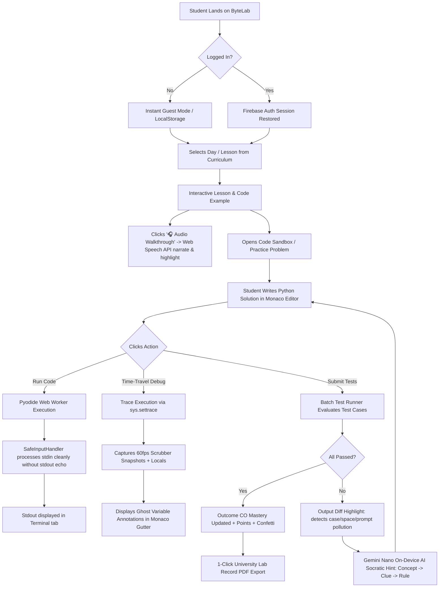
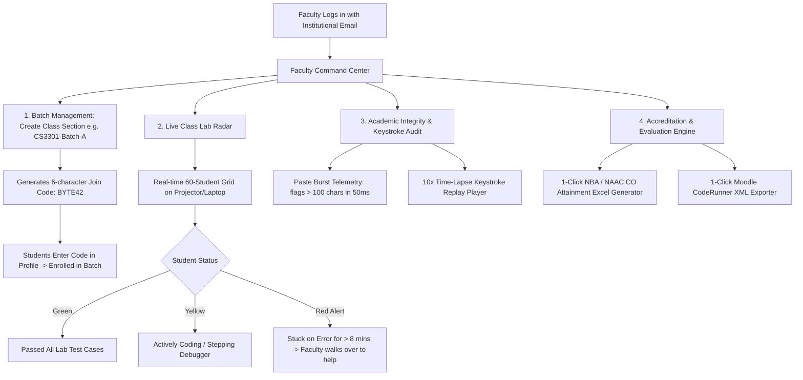

# ByteLab Core: Master Architecture, Workflows & Feature Blueprint

> **A Comprehensive Specification for a Zero-Backend, Client-Side WebAssembly Educational Laboratory for Students and Faculty**  
> *Author: Abhijith S & ByteLab Engineering Team*  
> *Status: Master Architectural Blueprint*  
> *Guiding Principle: 100% Free, Open-Source & Zero-Cost Online Technologies*

---

## 1. Executive Summary & Core Philosophy

**ByteLab** is an institutional-grade, tutorial-first Computer Science and Systems Programming platform designed to teach programming from first principles (focused initially on Anna University **CS3301 / 19AI301 Python Programming**, with multi-language architecture for C/C++, TypeScript, and Rust).

### 1.1 The Fundamental Paradigm: Zero-Backend Execution
Traditional coding platforms (LeetCode, HackerRank, Replit) depend on massive clusters of cloud Linux Docker containers. This model has three catastrophic flaws for academic institutions:
1. **Astronomical Cloud Hosting Costs**: Running thousands of student containers costs thousands of dollars per month.
2. **Network Latency & Server Queues**: Peak lab hours (e.g. 100 students clicking "Run" simultaneously during an exam) cause server queuing, timeouts, and crashes.
3. **Privacy & Security Risks**: Running untrusted student code on a server requires complex sandbox virtualization and network isolation.

**ByteLab solves this by shifting 100% of the compilation and execution workload to the student's browser via WebAssembly (Pyodide)**.
* **$0.00 Server Execution Cost**: The student's device CPU runs the code.
* **Zero Latency**: Code runs immediately in client memory with zero server roundtrip.
* **Infinite Scalability**: Whether 1 student or 100,000 students run code simultaneously, server load remains strictly zero.
* **Offline-Resilient**: Runs seamlessly even on unstable or disconnected college campus Wi-Fi.

---

## 2. System Architecture Blueprint

```
┌────────────────────────────────────────────────────────────────────────────────────────────────────────┐
│                                       CLIENT BROWSER ENVIRONMENT                                       │
├────────────────────────────────────────────────────────────────────────────────────────────────────────┤
│                                                                                                        │
│   ┌────────────────────────────────────────────────────────────────────────────────────────────────┐   │
│   │                                PRESENTATION & UI LAYER (React 18)                              │   │
│   │  • Monaco Editor (@monaco-editor/react) with Custom Glyphs, Gutter Breakpoints, Ghost Markers   │   │
│   │  • Tailwind CSS v4 Modern Theme + Lucide Icons + Sonner Notifications                          │   │
│   │  • Micro-Components: Time-Travel Scrubber, Test Results Table, Stdin Drawer, Diagnostics      │   │
│   └───────────────────────────────────────────────┬────────────────────────────────────────────────┘   │
│                                                   │                                                    │
│   ┌───────────────────────────────────────────────▼────────────────────────────────────────────────┐   │
│   │                                APPLICATION STATE & LOGIC LAYER                                 │   │
│   │  • progressStore.js (Zustand: Points, Streaks, Course Outcomes CO1-CO5, Completed Days)        │   │
│   │  • practiceStore.js (Zustand: Test Cases, Main Stdout, Execution State, Timer State)          │   │
│   │  • authStore.js     (Zustand: User Profile, Role [Student/Faculty], Session Cookies)          │   │
│   │  • uiStore.js       (Zustand: Cmd+K Search, Focus Mode, Stdin Drawer, Active Tabs)             │   │
│   └───────────────────────┬───────────────────────────────┬────────────────────────────────────────┘   │
│                           │                               │                                            │
│   ┌───────────────────────▼───────────────┐   ┌───────────▼────────────────────────────────────────┐   │
│   │   OFFLINE PERSISTENCE & STORAGE       │   │        WEB WORKER PYTHON RUNTIME PIPELINE          │   │
│   │  • IndexedDB (`idb`): Offline Course  │   │  • pythonRuntime.js (Promise Dispatcher & Timeout) │   │
│   │    Content, Problem Drafts, History   │   │  • python.worker.js (Isolated Background Worker)   │   │
│   │  • LocalStorage: Session state,       │   │    ├── Pyodide v0.27.2 WebAssembly Kernel          │   │
│   │    drafts, Pomodoro timers            │   │    ├── SafeInputHandler (Zero-Pollution Stdin)     │   │
│   │  • authCookieManager: Secure session  │   │    ├── sys.settrace Hook (Line-by-line snapshots)  │   │
│   │    token tracking                     │   │    └── AST Static Analyzer & Error Formatter       │   │
│   └───────────────────────────────────────┘   └────────────────────────────────────────────────────┘   │
│                                                                                                        │
└───────────────────────────────────────────────────┬────────────────────────────────────────────────────┘
                                                    │
┌───────────────────────────────────────────────────▼────────────────────────────────────────────────────┐
│                               FREE CLOUD & EDGE INFRASTRUCTURE (0 COST)                                │
├────────────────────────────────────────────────────────────────────────────────────────────────────────┤
│  • Cloudflare Pages / Workers: Global CDN Edge Hosting, Single-Page App router, 1-Year Assets Cache    │
│  • Google Firebase Auth: Unlimited Free Email/Password & Google OAuth Authentication                  │
│  • Google Cloud Firestore: Free Tier (50,000 daily reads) for Class Rosters & Live Lab Radar          │
│  • Google Public STUN Servers (stun:stun.l.google.com:19302): Free WebRTC P2P Pair Programming Relay  │
│  • On-Device Chrome Gemini Nano (`window.ai`): 100% Free Local AI Socratic Tutoring (Zero Cloud Token) │
└────────────────────────────────────────────────────────────────────────────────────────────────────────┘
```

---

## 3. End-to-End Workflows

### 3.1 Student Learning & Practice Workflow



#### Detailed Student Lifecycle:
1. **Entry & Onboarding**:
   - Zero-barrier entry: Students can start typing code immediately in guest mode without entering credit cards or passwords.
   - Progress and code drafts automatically cache in `localStorage` and `IndexedDB`.
2. **Concept Assimilation**:
   - Students consume bite-sized conceptual lessons with interactive runnable code examples.
   - **Audio Walkthrough**: Powered by `window.speechSynthesis`, students listen to natural spoken explanations while Monaco Editor spotlights the corresponding tokens.
3. **Implementation & Zero-Pollution Execution**:
   - Students write code in Monaco Editor with full autocomplete, syntax highlighting, and inline error lens.
   - When code calls `input()`, `SafeInputHandler` feeds input lines sequentially without polluting the standard output stream (`stdout_buf`), guaranteeing exact test assertion matching.
4. **Time-Travel Visual Debugging**:
   - If logic fails, students click **"Debug"** or **"Debug Test Case"**.
   - The browser traces the program step-by-step, providing a 60fps scrubber slider, loop iteration counters (`Iteration 2/5`), and cyan inline ghost pills (`// total: 100, i: 2`).
5. **On-Device Socratic Remediation**:
   - If students encounter an error (e.g. `IndexError`, `TypeError`, `EOFError`), Chrome Gemini Nano (`window.ai`) or ByteLab's local heuristic engine delivers a 3-tier progressive hint ladder (*1. Concept $\rightarrow$ 2. Clue $\rightarrow$ 3. Rule*) without giving away code spoilers.
6. **Academic Documentation**:
   - Upon completing lab problems, students click **"Export Lab Record"** to download an official university-formatted PDF with Aim, Algorithm, Verified Code, and Test Run Results.

---

### 3.2 Staff & Faculty Classroom Management Workflow



#### Detailed Faculty Lifecycle:
1. **Batch Provisioning**:
   - Professor creates a class batch (e.g. `CS3301-AI-Batch-B-2026`) in 10 seconds.
   - Distributes a 6-character code (`BYTE42`) to the class; students join in one click.
2. **Real-time In-Lab Monitoring (Lab Radar)**:
   - During scheduled lab periods, the faculty monitor displays a live grid of student workstations.
   - Instantly highlights students who are struggling or falling behind without requiring manual walk-arounds.
3. **Plagiarism & Authenticity Verification**:
   - Automated detection identifies AI copy-pasting via typing velocity metrics.
   - Faculty can press **"Replay"** on any submission to view an animated time-lapse reconstruction of the student writing their code from scratch.
4. **Accreditation Compliance**:
   - At semester's end, faculty click **"Export NBA Attainment"**, instantly producing university-compliant Course Outcome spreadsheets (`.xlsx`) with averages and graphs.
5. **LMS Bridge**:
   - Faculty export ByteLab problem sets directly into Moodle XML for automated grading on university LMS servers.

---

## 4. Master Feature Specifications: 12 Core Innovations

### Category A: Student Innovations (100% Free Resources)

#### Feature 1: Memory Heap & Data Structure Visualizer
* **Purpose**: Demystifies pointers, arrays, dictionaries, stacks, and recursion call trees.
* **Mechanism**:
  - Leverages Python's `sys.settrace` inside the Pyodide Web Worker to extract memory pointers (`id(obj)`), data types, and reference graphs at every step.
  - Renders interactive DOM/SVG nodes:
    - Lists: Horizontal contiguous indexed cells.
    - Dictionaries: Key-value bucket mappings with collision paths.
    - Recursion: Expanding and contracting stack frame trees.
* **Technology**: Client-side SVG + HTML5 Canvas + Pyodide AST inspector. **$0.00 Cost**.

#### Feature 2: College Lab Exam Simulator
* **Purpose**: Replicates high-stakes practical lab examinations under real university constraints.
* **Mechanism**:
  - **Timed Clock**: Isolated Web Worker timer immune to background tab throttling.
  - **Anti-Cheat Monitoring**:
    - Enforces HTML5 Fullscreen (`requestFullscreen()`).
    - Tracks tab switching via `document.visibilityState` and window blur events with recorded exit warnings.
  - **Randomized Question Bank**: Generates 2 randomized questions across different units according to Anna University exam patterns.
* **Technology**: Browser Fullscreen API + Page Visibility API + Web Workers. **$0.00 Cost**.

#### Feature 3: P2P Pair Programming Study Rooms
* **Purpose**: Enables collaborative peer problem solving and remote tutoring without expensive collaboration software.
* **Mechanism**:
  - Uses WebRTC DataChannels connected through public Google STUN servers (`stun:stun.l.google.com:19302`).
  - Employs CRDT (Conflict-free Replicated Data Types via `Yjs`) to achieve sub-50ms peer-to-peer keystroke synchronization.
  - Displays peer cursor badges and synchronized terminal output streams.
* **Technology**: WebRTC DataChannels + Google STUN + Yjs. **$0.00 Cost**.

#### Feature 4: University Lab Record Book PDF Generator
* **Purpose**: Eliminates dozens of hours of manual handwriting for engineering lab record books.
* **Mechanism**:
  - Assembles student details (Name, Register Number, Department) with verified solutions.
  - Formats university-standard sections: *Aim, Algorithm, Flowchart, Source Code, Input, Output, and Result*.
  - Generates a tamper-proof verification QR code encoding the problem hash and verification timestamp.
* **Technology**: Client-side `jsPDF` + `qrcode.js`. **$0.00 Cost**.

#### Feature 5: Daily Spaced-Repetition (SRS) Flashcard Drills
* **Purpose**: Overcomes the forgetting curve for Python syntax, built-in functions, and algorithmic time complexities.
* **Mechanism**:
  - SuperMemo SM-2 algorithm computes interval scheduling ($I_n = I_{n-1} \times EF$).
  - 3-minute daily warmups with runnable micro-prompts validated in Pyodide.
* **Technology**: Client-side IndexedDB (`idb`) + SuperMemo SM-2 logic. **$0.00 Cost**.

#### Feature 6: Voice Code Narrator & Token Spotlight
* **Purpose**: Supports auditory and ESL learners through synchronized multi-sensory code walkthroughs.
* **Mechanism**:
  - Uses the browser's native `window.speechSynthesis` to speak natural line-by-line explanations.
  - Synchronizes audio timestamps with Monaco Editor's `deltaDecorations` to illuminate the exact code token being discussed.
* **Technology**: W3C Web Speech API. **$0.00 Cost**.

---

### Category B: Faculty & Staff Innovations (100% Free Resources)

#### Feature 7: Live Class Lab Radar & Roster Monitor
* **Purpose**: Gives faculty instant situational awareness over 60+ students during active computer lab sessions.
* **Mechanism**:
  - Students emit lightweight heartbeat pings on code run or error (max 1 write per 30 seconds).
  - Faculty dashboard subscribes to Firestore real-time snapshot (`onSnapshot`) to render live colored workstation tiles.
  - Flags students stuck on identical errors for > 8 minutes with a "Needs Assistance" indicator.
* **Technology**: Firebase Firestore Free Tier (50k daily reads / 20k writes). **$0.00 Cost**.

#### Feature 8: Keystroke Integrity & 10x Code Replay Player
* **Purpose**: Detects external AI copy-pasting (ChatGPT, Copilot) without intrusive surveillance.
* **Mechanism**:
  - Monitors keystroke inter-arrival intervals and clipboard paste events.
  - Flags anomalous character bursts (> 50 characters within 100ms).
  - Records a lightweight delta changelog allowing faculty to hit "Replay" and watch the code emerge in an organic 10x time-lapse animation.
* **Technology**: Client-side Monaco delta recording + statistical cadence scoring. **$0.00 Cost**.

#### Feature 9: 1-Click Moodle XML & Canvas QTI Exporter
* **Purpose**: Bridges ByteLab exercises directly into official institutional learning management systems.
* **Mechanism**:
  - Serializes ByteLab problem statements, starter templates, sample cases, and hidden test cases into standard **Moodle CodeRunner XML** or **Canvas QTI `.zip`** archives.
* **Technology**: Client-side XML DOM serialization + Blob download. **$0.00 Cost**.

#### Feature 10: NBA / NAAC Course Outcome (CO) Attainment Excel Generator
* **Purpose**: Automates weeks of tedious manual calculation required for National Board of Accreditation audits.
* **Mechanism**:
  - Aggregates student quiz and lab test scores mapped to Course Outcomes (`CO1` through `CO5`).
  - Computes class attainment thresholds (% scoring above target criteria).
  - Generates a complete university-formatted Excel file (`.xlsx`) complete with color-coded grade distributions and summary charts.
* **Technology**: Client-side `xlsx` (SheetJS) library. **$0.00 Cost**.

#### Feature 11: Instructor Custom Problem & Test Case Workbench
* **Purpose**: Allows professors to author proprietary questions and university lab exam problems.
* **Mechanism**:
  - Web UI for problem authoring: Markdown text, Course Outcome tag, hidden test cases, and restricted keywords (e.g. *"Forbidden: `import math`"*).
  - **Pre-Flight Validation**: Pyodide runs the instructor's solution against their own test suite client-side to verify correctness before assigning to students.
* **Technology**: Pyodide client execution + Firestore free tier. **$0.00 Cost**.

#### Feature 12: Automated Code Quality & Grading Rubric
* **Purpose**: Provides deep formative grading feedback without imposing manual code-review fatigue on instructors.
* **Mechanism**:
  - Python AST analyzer (`pythonStaticAnalyzer.js`) audits code against PEP 8 style, variable naming, function length, and cognitive complexity.
  - Combines correctness score + complexity score + clean code score into an objective marks breakdown.
* **Technology**: Client-side Python AST analysis + Chrome Gemini Nano. **$0.00 Cost**.

---

## 5. Free Online Resource Strategy & Limits Matrix

Every architectural element has been rigorously budgeted to operate entirely within free quotas:

| Component | Free Online Resource | Free Quota / Limits | Zero-Cost Implementation Strategy |
| :--- | :--- | :--- | :--- |
| **Execution Engine** | **Pyodide WebAssembly** | **Unlimited** | Executes in client browser Web Worker; zero server compute needed. |
| **AI Mentoring** | **Chrome Gemini Nano (`window.ai`)** | **Unlimited** | Executes on user's device GPU/NPU; zero API token costs. |
| **Cloud Hosting & CDN** | **Cloudflare Workers / Pages** | **100,000 requests/day** | Static assets cached at the edge for 1 year via `public/_headers`. |
| **Realtime Lab Data** | **Firebase Cloud Firestore** | **50,000 reads, 20,000 writes/day** | Heartbeat batching & snapshot throttling fits 5+ lab classes/day. |
| **User Authentication** | **Firebase Auth** | **Unlimited Email & Google** | Handles thousands of student/staff sign-ins at zero cost. |
| **Pair Programming** | **WebRTC + Google Public STUN** | **Unlimited P2P** | Direct browser-to-browser data channels (`stun:stun.l.google.com`). |
| **Audio Walkthrough** | **W3C Web Speech API** | **Unlimited** | Built directly into browser engines (Chrome, Edge, Safari). |
| **Reports & Records** | **SheetJS (`xlsx`) & `jsPDF`** | **Unlimited** | Compiles Excel and PDF files entirely inside client RAM. |
| **Offline Storage** | **Browser IndexedDB (`idb`)** | **50GB+ per browser origin**| Caches 100% of curriculum, problems, and test logs offline. |

---

## 6. Implementation & Rollout Roadmap

```
  PHASE 1 (Quick Wins)           PHASE 2 (Assessment)          PHASE 3 (Classroom Radar)      PHASE 4 (Deep Tech)
┌─────────────────────────┐    ┌─────────────────────────┐   ┌──────────────────────────┐   ┌────────────────────────┐
│ • Lab Record PDF (S4)   │───►│ • Exam Simulator (S2)   │──►│ • Live Lab Radar (F1)    │──►│ • Memory Visualizer(S1)│
│ • Moodle Exporter (F3)  │    │ • NBA CO Excel (F4)     │   │ • Keystroke Replay (F2)  │   │ • P2P WebRTC Pairs (S3)│
│ • SRS Flashcards (S5)   │    │ • Voice Narrator (S6)   │   │ • Problem Workbench (F5) │   │ • Quality Rubric (F12) │
└─────────────────────────┘    └─────────────────────────┘   └──────────────────────────┘   └────────────────────────┘
```

* **Phase 1 (Academic Documentation & Quick Value)**:
  - Implement the **Automated Lab Record Book PDF Generator** (`jsPDF`) and **Moodle CodeRunner XML Exporter**. Immediate time savings for both students and faculty.
* **Phase 2 (Exams, Accreditation & Audio)**:
  - Implement the **Timed College Lab Exam Simulator** with anti-cheat fullscreen monitoring, **NBA CO Attainment Excel Generator**, and **Web Speech Code Walkthrough**.
* **Phase 3 (Live Classroom Command Center)**:
  - Implement the **Live Class Lab Radar Dashboard** (Firestore free tier) and **Keystroke Integrity / 10x Replay Player**.
* **Phase 4 (Advanced Visualization & P2P)**:
  - Implement the **Memory Heap & Data Structure Visualizer** in Monaco and **WebRTC P2P Collaborative Study Rooms**.
